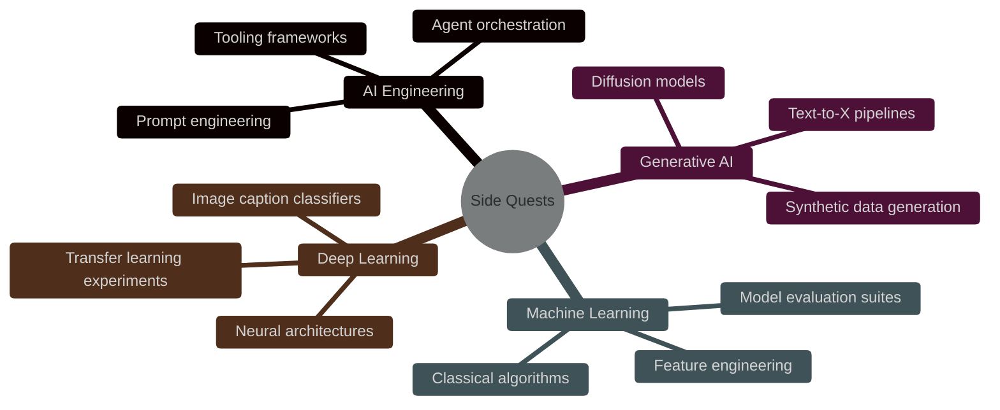
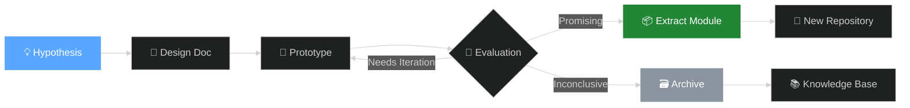

<div align="center">

<!-- Animated Header Banner -->
<pre style="font-family: 'Courier New', monospace;">
╔══════════════════════════════════════════════════════════════════════════════════════════╗
║                                                                                          ║
║   ███████╗██╗██████╗ ███████╗     ██████╗ ██╗   ██╗███████╗███████╗████████╗███████╗     ║
║   ██╔════╝██║██╔══██╗██╔════╝    ██╔═══██╗██║   ██║██╔════╝██╔════╝╚══██╔══╝██╔════╝     ║
║   ███████╗██║██║  ██║█████╗      ██║   ██║██║   ██║█████╗  ███████╗   ██║   ███████╗     ║
║   ╚════██║██║██║  ██║██╔══╝      ██║▄▄ ██║██║   ██║██╔══╝  ╚════██║   ██║   ╚════██║     ║
║   ███████║██║██████╔╝███████╗    ╚██████╔╝╚██████╔╝███████╗███████║   ██║   ███████║     ║
║   ╚══════╝╚═╝╚═════╝ ╚══════╝     ╚══▀▀═╝  ╚═════╝ ╚══════╝╚══════╝   ╚═╝   ╚══════╝     ║
║                                                                                          ║
║              <em>Experimental Computing Laboratory & Digital Atelier</em>                ║
║                                                                                          ║
╚══════════════════════════════════════════════════════════════════════════════════════════╝
</pre>

<!-- Dynamic Badges -->
<p>
  
  
  
  
  
</p>

<!-- Typing Effect Tagline -->
<a href="https://git.io/typing-svg">
  
</a>

<br/><br/>

<!-- Quick Stats Row -->
<table>
  <tr>
    <td align="center"><strong>🧪 Experiments</strong><br/><code>4 Active</code></td>
    <td align="center"><strong>🤖 Agents</strong><br/><code>3 Deployed</code></td>
    <td align="center"><strong>🧠 Models</strong><br/><code>7 Trained</code></td>
    <td align="center"><strong>⚡ Commits</strong><br/><code>13+</code></td>
  </tr>
</table>

</div>

---

<!-- Table of Contents with Anchor Links -->
## 📋 Table of Contents

- [Philosophy](#-philosophy)
- [Repository Cartography](#-repository-cartography)
- [Technology Stack](#-technology-stack)
- [Getting Started](#-getting-started)
- [Project Index](#-project-index)
- [Development Workflow](#-development-workflow)
- [Contributing](#-contributing)
- [License & Attribution](#-license--attribution)

---

## 🧭 Philosophy

> *"The side quest is not a distraction from the main story — it is where the character levels up."*

This repository serves as a **computational laboratory** for small-scale experiments, tooling prototypes, learning artifacts, and exploratory systems. It operates under the principle that **serendipitous discovery requires structured chaos**. Every directory represents a hypothesis; every commit, an experiment concluded.

### Core Tenets

| Tenet | Description |
|-------|-------------|
| **🎯 Intentional Scope** | Each experiment is bounded, measurable, and independently reproducible |
| **📝 Narrative Code** | Documentation is not an afterthought — it is the primary artifact |
| **🔄 Composability** | Modules are designed to be extracted, repurposed, or abandoned without collateral damage |
| **🌊 Fluid Architecture** | Directories evolve; what begins as `03-generative-ai` may seed a standalone repository |

---

## 🗺️ Repository Cartography



### Directory Structure

```text
side-quests/
│
├── 📁 01-ai-engineering/
│   └── Agent systems, prompt engineering frameworks, and LLM tooling
│
├── 📁 03-generative-ai/
│   └── Generative models, synthetic media pipelines, and creative AI
│
├── 📁 04-machine-learning/
│   └── Classical ML experiments, feature engineering, and model suites
│
├── 📁 07-deep-learning/
│   └── Neural architectures, computer vision, and deep learning research
│   └── 📁 image-caption-classifier/
│       └── Vision-language model for automated image understanding
│
└── 📄 README.md
    └── You are here. Meta-documentation for the repository itself.
```

> **Note on Numeration:** Directory prefixes (`01-`, `03-`, etc.) reflect chronological exploration phases, not priority. Gaps exist where experiments were concluded, extracted, or archived.

---

## 🛠️ Technology Stack

<div align="center">

<!-- Stack Icons Grid -->
<table>
  <tr>
    <td align="center" width="96">
      
      <br/><sub><b>Python</b></sub>
    </td>
    <td align="center" width="96">
      
      <br/><sub><b>PyTorch</b></sub>
    </td>
    <td align="center" width="96">
      
      <br/><sub><b>TensorFlow</b></sub>
    </td>
    <td align="center" width="96">
      
      <br/><sub><b>Jupyter</b></sub>
    </td>
    <td align="center" width="96">
      
      <br/><sub><b>Docker</b></sub>
    </td>
    <td align="center" width="96">
      
      <br/><sub><b>Git</b></sub>
    </td>
  </tr>
  <tr>
    <td align="center" width="96">
      
      <br/><sub><b>NumPy</b></sub>
    </td>
    <td align="center" width="96">
      
      <br/><sub><b>Pandas</b></sub>
    </td>
    <td align="center" width="96">
      
      <br/><sub><b>OpenCV</b></sub>
    </td>
    <td align="center" width="96">
      
      <br/><sub><b>FastAPI</b></sub>
    </td>
    <td align="center" width="96">
      
      <br/><sub><b>Linux</b></sub>
    </td>
    <td align="center" width="96">
      
      <br/><sub><b>VS Code</b></sub>
    </td>
  </tr>
</table>

</div>

---

## 🚀 Getting Started

### Prerequisites

- **Python** ≥ 3.10
- **Git** ≥ 2.35
- **Poetry** or **pip** (dependency management)
- **CUDA** ≥ 11.8 (for GPU-accelerated experiments)

### Quick Start

```bash
# Clone the repository
git clone https://github.com/pseudobarbie/side-quests.git
cd side-quests

# Navigate to an experiment (example: image-caption-classifier)
cd 07-deep-learning/image-caption-classifier

# Install dependencies
pip install -r requirements.txt
# or
poetry install

# Run the experiment
python main.py
```

### Environment Isolation

Each experiment directory is self-contained. We recommend using **Conda** or **venv** per project to prevent dependency entropy:

```bash
python -m venv .venv
source .venv/bin/activate  # Linux/macOS
# .venv\Scripts\activate  # Windows
```

---

## 📚 Project Index

<details>
<summary><b>🧠 01-ai-engineering — Agent Systems & LLM Tooling</b></summary>
<br/>

| Experiment | Status | Description |
|------------|--------|-------------|
| `travel-agent-planner` | ✅ Complete | LLM-powered itinerary generation with constraint satisfaction |
| `prompt-chaining` | 🚧 WIP | Multi-stage prompt decomposition for complex reasoning |
| `tool-use-framework` | 🚧 WIP | ReAct-pattern agent with extensible tool registry |

</details>

<details>
<summary><b>🎨 03-generative-ai — Synthetic Media & Creative Models</b></summary>
<br/>

| Experiment | Status | Description |
|------------|--------|-------------|
| `text-to-image-pipeline` | 🚧 WIP | Fine-tuned diffusion model for domain-specific generation |
| `synthetic-data-generator` | 🚧 WIP | Tabular and text synthetic data for privacy-preserving ML |

</details>

<details>
<summary><b>📊 04-machine-learning — Classical ML & Analytics</b></summary>
<br/>

| Experiment | Status | Description |
|------------|--------|-------------|
| `ensemble-methods` | 🚧 WIP | Comparative analysis of boosting, bagging, and stacking |
| `feature-engineering-suite` | 🚧 WIP | Automated feature selection and transformation pipelines |

</details>

<details>
<summary><b>🔬 07-deep-learning — Neural Architectures & CV</b></summary>
<br/>

| Experiment | Status | Description |
|------------|--------|-------------|
| `image-caption-classifier` | ✅ Complete | Vision-language model combining CNN encoders with LSTM/Transformer decoders |
| `transfer-learning-benchmark` | 🚧 WIP | Systematic evaluation of fine-tuning strategies across architectures |

</details>

---

## ⚙️ Development Workflow



### Commit Convention

We follow a **semantic commit** structure to maintain narrative coherence across experiments:

```text
feat(01-ai): add ReAct agent scaffolding
fix(07-dl): resolve gradient accumulation in caption classifier
chore(repo): update root README with project index
docs(04-ml): document ensemble method hyperparameters
```

---

## 🤝 Contributing

While this is primarily a **personal research repository**, constructive contributions are welcome under the following guidelines:

1. **Fork** the repository and create a feature branch (`git checkout -b experiment/amazing-idea`)
2. **Document** your hypothesis in the experiment's `README.md`
3. **Isolate** dependencies — do not pollute the root environment
4. **Submit** a Pull Request with a clear description of the experiment's objective and findings

> ⚠️ **Note:** Experiments may be archived or removed if they are concluded, extracted, or superseded. This is by design.

---

## 📜 License & Attribution

```text
MIT License

Copyright (c) 2026 pseudobarbie

Permission is hereby granted, free of charge, to any person obtaining a copy
of this software and associated documentation files (the "Software"), to deal
in the Software without restriction, including without limitation the rights
to use, copy, modify, merge, publish, distribute, sublicense, and/or sell
copies of the Software, and to permit persons to whom the Software is
furnished to do so, subject to the following conditions:

The above copyright notice and this permission notice shall be included in all
copies or substantial portions of the Software.

THE SOFTWARE IS PROVIDED "AS IS", WITHOUT WARRANTY OF ANY KIND, EXPRESS OR
IMPLIED, INCLUDING BUT NOT LIMITED TO THE WARRANTIES OF MERCHANTABILITY,
FITNESS FOR A PARTICULAR PURPOSE AND NONINFRINGEMENT. IN NO EVENT SHALL THE
AUTHORS OR COPYRIGHT HOLDERS BE LIABLE FOR ANY CLAIM, DAMAGES OR OTHER
LIABILITY, WHETHER IN AN ACTION OF CONTRACT, TORT OR OTHERWISE, ARISING FROM,
OUT OF OR IN CONNECTION WITH THE SOFTWARE OR THE USE OR OTHER DEALINGS IN THE
SOFTWARE.
```

---

<div align="center">

<!-- Footer with Social Links -->
<p>
  <a href="https://github.com/pseudobarbie">
    
  </a>
</p>

<!-- Activity Graph -->


<br/><br/>

<!-- Closing Quote -->
<p><em>"The most exciting phrase to hear in science, the one that heralds new discoveries, is not 'Eureka!' but 'That's funny...'"</em></p>
<p>— Isaac Asimov</p>

<br/>

<picture>
  <source media="(prefers-color-scheme: dark)" srcset="https://raw.githubusercontent.com/platane/snk/output/github-contribution-grid-snake-dark.svg">
  <source media="(prefers-color-scheme: light)" srcset="https://raw.githubusercontent.com/platane/snk/output/github-contribution-grid-snake.svg">
  
</picture>

</div>
